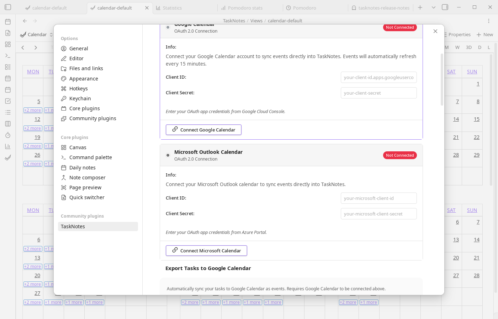

# Calendar Integration Setup

TaskNotes supports Google Calendar and Microsoft Calendar integration via OAuth 2.0.

## Setup (Your Own OAuth Credentials)

To connect calendars, create OAuth credentials with Google and/or Microsoft, then paste them into TaskNotes Integrations settings. The sections below walk through each provider.



### Google Calendar

<iframe width="560" height="315" src="https://www.youtube.com/embed/DzMN1Wu2P-g?start=210" title="How to set up Google Calendar OAuth" frameborder="0" allow="accelerometer; autoplay; clipboard-write; encrypted-media; gyroscope; picture-in-picture" allowfullscreen></iframe>

*Video by [@antoneheyward](https://www.youtube.com/@antoneheyward)*

In [Google Cloud Console](https://console.cloud.google.com), create or select a project, enable the Google Calendar API, and create OAuth 2.0 credentials using the Desktop application type. Then copy the Client ID and Client Secret into TaskNotes (`Settings -> TaskNotes -> Integrations`) and click **Connect Google Calendar**.

### Microsoft Calendar

In [Azure Portal](https://portal.azure.com), create an App Registration and then configure loopback redirect support in the manifest by adding:

```json
{
  "url": "http://127.0.0.1",
  "type": "Web"
}
```

Azure may reject this URI in the normal UI, but accepts it via manifest editing; loopback ports are ignored during matching. Next, add API permissions (`Calendars.Read`, `Calendars.ReadWrite`, and `offline_access`), grant consent when required, and create a client secret. Copy the Application (client) ID and secret value into TaskNotes, then click **Connect Microsoft Calendar**.

## Security Notes

Credentials and tokens are stored locally in your Obsidian data. Tokens refresh automatically, calendar data syncs directly between your vault and provider, and you can disconnect at any time to revoke access.

## Troubleshooting

**"Failed to connect"**

Verify credentials first, then confirm loopback redirect configuration. TaskNotes uses a local callback on `127.0.0.1` with a dynamically selected port. For Microsoft, ensure loopback redirect support is configured in the app registration. Also confirm required permissions/scopes are granted.

**"Failed to fetch events"**

Disconnect and reconnect to refresh OAuth tokens, then re-check provider-side calendar permissions.

**Connection lost after Obsidian restart**

Tokens should persist between sessions. If reconnection is required each restart, investigate vault or plugin-data file permissions.
