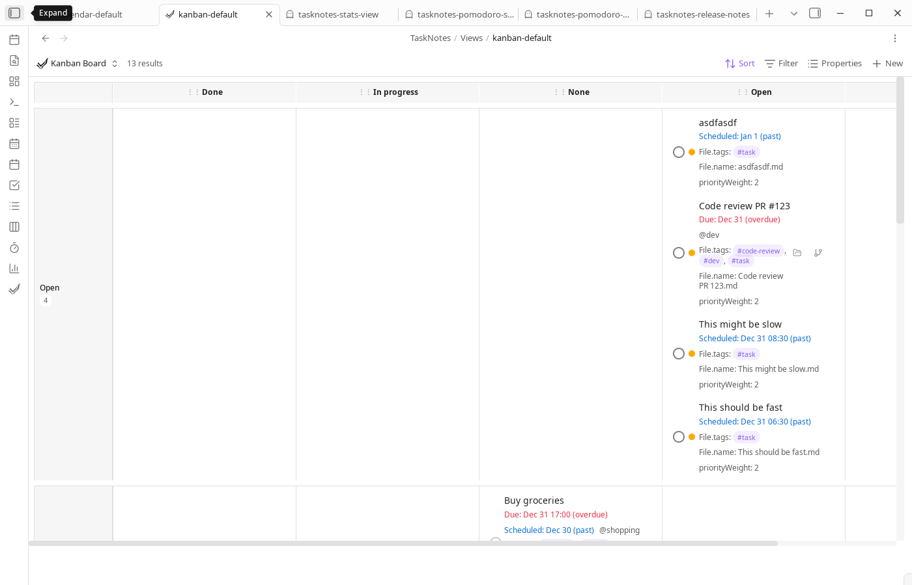

# Kanban View


The Kanban View displays tasks as cards organized in columns, where each column represents a distinct value of a grouped property.
Kanban emphasizes state transitions and drag operations over dense list scanning.



## Configuration

Kanban views are stored as `.base` files in `TaskNotes/Views/`. The `groupBy` property determines the column structure—each unique value becomes a column in the board. Open a `.base` file and access the view settings panel to configure options.

### Core Settings (Bases)

- **Data source**: Select which files or folders to include in the view
- **Filter**: Define criteria to include or exclude specific tasks
- **Sort**: Specify the order of tasks within each column
- **Group by**: Required. Defines the property that creates columns (e.g., status, priority)
Choosing a stable `groupBy` field is the most important design decision. Frequent changes to this field create column churn and make historical comparisons harder.

### Kanban-Specific Options

Access these options through the Bases view settings panel:

- **Swim Lane**: Optional property for horizontal grouping. Creates a two-dimensional layout where tasks are organized by both column (groupBy) and row (swimLane)
- **Column Width**: Controls the width of columns in pixels. Range: 200-500px. Default: 280px
- **Hide Empty Columns**: When enabled, columns containing no tasks are hidden from the view
- **Show items in multiple columns**: When enabled (default), tasks with multiple values in list properties (contexts, tags, projects) appear in each individual column. For example, a task with `contexts: [work, call]` appears in both the "work" and "call" columns. When disabled, tasks appear in a single combined column (e.g., "work, call")
- **Column Order**: Managed automatically when dragging column headers. Stores custom column ordering
A common setup is to keep one board grouped by status and another grouped by project or context, each in a separate `.base` file.

## Interface Layout

### Standard Layout

In standard mode, the Kanban board displays a horizontal row of columns. Each column corresponds to a unique value of the `groupBy` property.

Each column includes:
- A header showing the property value and task count
- A scrollable area containing task cards
- Drag-and-drop functionality for reordering columns or moving tasks between columns

### Swimlane Layout

When a `swimLane` property is configured, the board displays a grid layout. The horizontal axis represents columns (groupBy values), and the vertical axis represents swimlanes.

Each swimlane row includes:
- A label cell showing the swimlane property value and total task count
- Multiple cells, each representing a column within that swimlane
- Scrollable cells containing task cards

## Task Cards

Each task card displays information based on the visible properties configured in the Bases view. Standard task information includes title, priority, due date, and scheduled date.

To show checklist progress on cards, include `file.tasks` in the view `order` array.
For existing `.base` files, add this in YAML manually first; after it is in `order`, it appears in the Bases picker as `tasks`.

Click a card to open the task file for editing. Right-click to access the context menu for task actions. Drag cards between columns or swimlane cells to update the task's properties.

## Column Operations

### Reordering Columns

Drag column headers to reorder columns. The new order persists across sessions and is stored in the `columnOrder` configuration.

### Drag-and-Drop Tasks

Drag task cards between columns to update the `groupBy` property value. In swimlane mode, dragging a task to a different cell updates both the `groupBy` and `swimLane` properties.

When grouping by a list property (contexts, tags, projects) with "Show items in multiple columns" enabled, dragging a task between columns modifies the list rather than replacing it. The source column's value is removed and the target column's value is added. For example, dragging a task from the "work" column to the "home" column changes `contexts: [work, call]` to `contexts: [call, home]`.
Drag operations write directly to task metadata, so consistent grouping values reduce ambiguity.

### Manual Reordering Within Columns

Kanban also supports drag-to-reorder within a column or swimlane cell when the view is sorted by the manual-order property. With the default field mapping, that property is `tasknotes_manual_order`.

To enable persistent manual ordering within Kanban columns:

```yaml
sort:
  - column: tasknotes_manual_order
    direction: DESC
```

Once the first sort criterion is the manual-order property, dragging a card within the same column updates stored frontmatter values so the new order persists across refreshes and sessions.

In swimlane mode, the reorder scope is a single cell, not the entire board. A reorder inside the "In Progress" column for the "High" swimlane only adjusts the tasks in that cell.

Important constraints:

- Manual drag-to-reorder only works when the view sort includes the manual-order property.
- Moving a card to a different column or swimlane still updates the grouped property values as usual.
- In filtered or partially visible columns, TaskNotes may also update hidden or filtered notes in the same reorder scope to preserve a stable persistent order.
- Large reorder operations may show a confirmation dialog before writing changes.

The default generated TaskNotes templates use manual-order sorting in places where drag-to-reorder should work immediately, such as relationship views and manual-order task lists.

## Performance Optimization

The Kanban view implements virtual scrolling for columns or swimlane cells containing 30 or more tasks. This optimization reduces memory usage by approximately 85% and maintains 60fps scrolling performance for columns with 200+ tasks.

Virtual scrolling activates automatically based on task count. No configuration is required.

## Example Configuration

A typical Kanban view `.base` file includes:

```yaml
---
type: query
source: TaskNotes
view: TaskNotes Kanban
views:
  - name: TaskNotes Kanban
    type: tasknotesKanban
    groupBy:
      property: task.status
    config:
      swimLane: task.priority
      columnWidth: 300
      hideEmptyColumns: true
---
```

This configuration creates a Kanban board with:
- Columns based on task status
- Swimlanes based on task priority
- 300px column width
- Empty columns hidden

## Filtering and Sorting

Filtering and sorting are configured through the Bases view settings, not through a separate FilterBar component. Use the Bases filter editor to define conditions based on task properties. Use the Bases sort editor to specify the order of tasks within each column.
