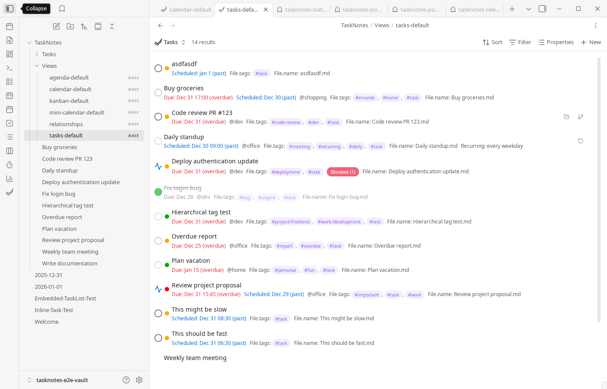
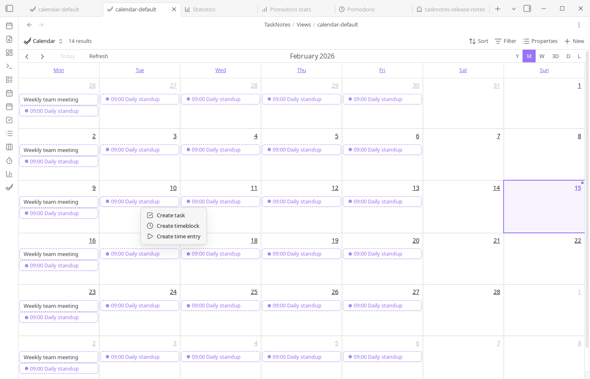

# Workflows

This page describes practical ways to combine TaskNotes features into repeatable workflows. The goal is to show how recurring tasks, projects, filtering, and scheduling fit together in everyday use.

## Habit Tracking with Recurring Tasks

Habit tracking in TaskNotes is built on recurring task notes. You can create a recurring task from natural language (for example, "Exercise daily" or "Gym every Monday and Wednesday") or configure recurrence explicitly in the task modal. The modal recurrence controls support frequency, interval, weekday selection, and end conditions.

Once a task has a recurrence rule, its edit modal shows a recurrence calendar. That calendar is where you mark completion per occurrence. Completion history is stored in `complete_instances`, so a recurring task can remain open while still recording daily/weekly completion behavior.


```yaml
title: Morning Exercise
recurrence: "FREQ=DAILY"
scheduled: "07:00"
complete_instances:
  - "2025-01-01"
  - "2025-01-02"
  - "2025-01-04"
```

Use Calendar and Agenda views to review upcoming occurrences, and use recurring-task filters when you want a habit-only planning view.

## Project-Centered Planning

Projects in TaskNotes can be plain text values or wikilinks to project notes. Wikilinks are usually the better long-term option because they connect task execution to project context, backlinks, and graph navigation.

```yaml
title: "Research competitors"
projects: ["[[Market Research]]", "[[Q1 Strategy]]"]
```

During task creation, use the project picker to search and assign one or more projects. In day-to-day planning, open Task List or Kanban, then filter on `note.projects contains [[Project Name]]` to isolate one initiative. Save that filter as a Bases saved view if you revisit it regularly.



When work spans initiatives, assign multiple projects and combine with contexts or tags for secondary organization.

```yaml
title: "Prepare presentation slides"
projects: ["[[Q4 Planning]]"]
contexts: ["@computer", "@office"]
tags: ["#review"]
```

## Execution Workflow (Daily)

A typical daily flow is to start in Task List for prioritization, move to Calendar for schedule placement, and finish in Agenda for near-term sequencing. This keeps backlog management, time allocation, and short-horizon execution in one system.

If you use timeboxing, drag-select on calendar timeline views and create timeblocks directly from the context menu. If you use Pomodoro, run sessions against active tasks so completion and timing data stay attached to task notes.



## Maintenance Workflow (Weekly)

A weekly review usually includes three steps: clean up completed/archived tasks, verify recurring-task completion patterns, and rebalance project filters/views. If calendar integrations are enabled, this is also a good point to refresh subscriptions and confirm sync health.

For teams or complex personal systems, keep project notes as source-of-truth documents and use TaskNotes views as execution dashboards derived from those notes.
